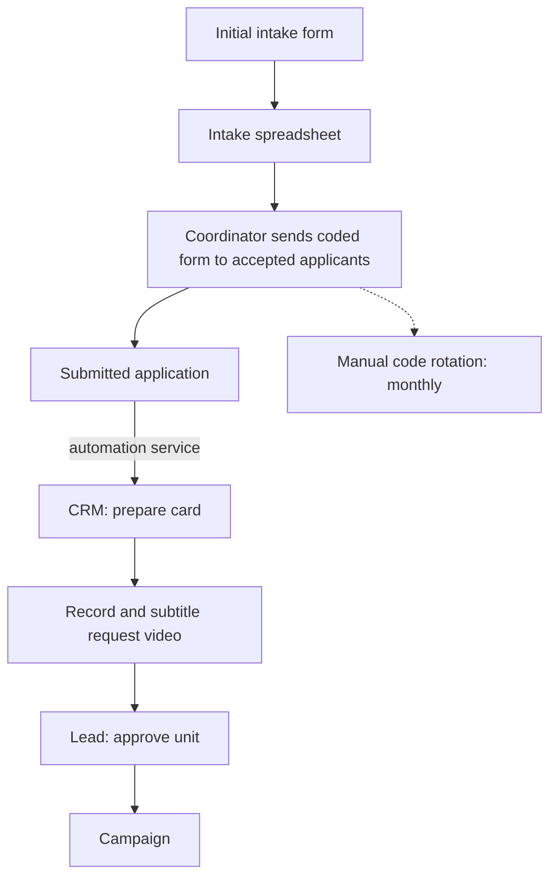
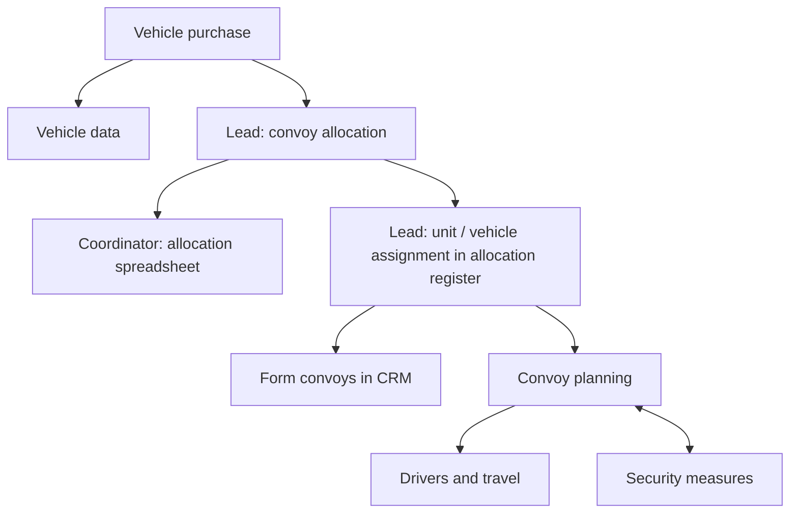
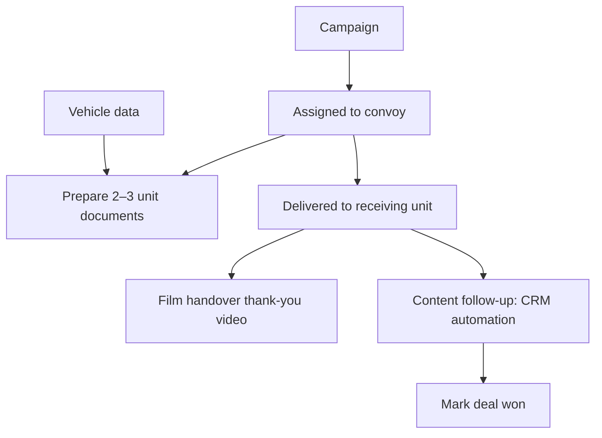
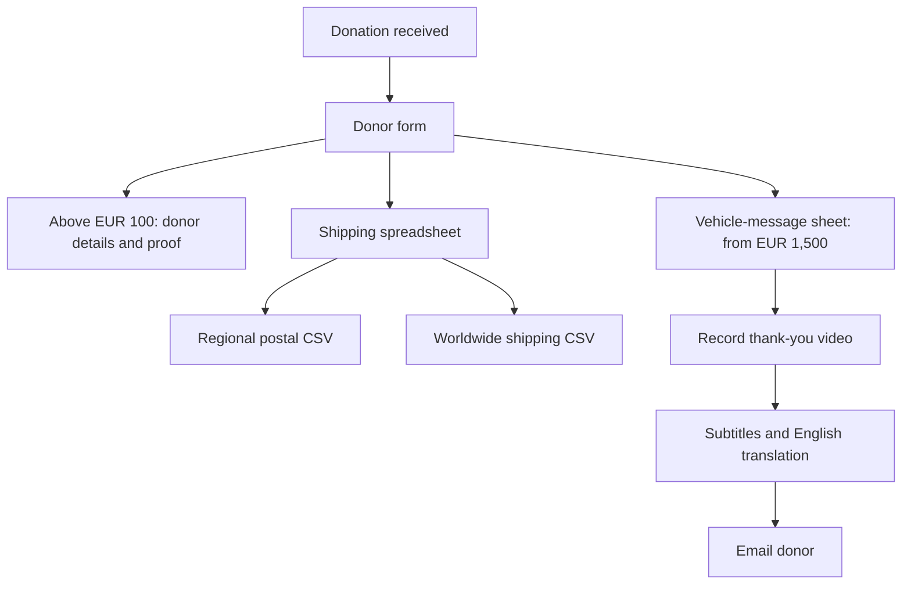
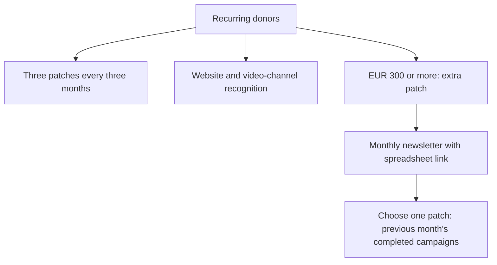

# OPS ManUAl

## 1. MISSION & STRUCTURE

Deliver vehicles to approved receiving units. Raise funds, fulfill donor commitments, and complete content follow-up before closing each deal.

**Three mission pillars. One shared support pillar.**

| Pillar | Function |
| --- | --- |
| **Marketing & Fundraising** | Build support, run campaigns, generate funds. |
| **MilOps** | Manage unit requests, vehicles, convoys, and delivery. |
| **DonorOps** | Manage donor records, benefits, fulfillment, and follow-up. |
| **OrgOps** | Support all three through people, systems, records, and coordination. |

---

. 

## 2. MARKETING (+ FUNDRAISING)

**Purpose:** Convert public support into funding for the mission.

**Responsibilities:** Campaign preparation, content production, promotion, fundraising, and performance reporting.

### Workflow

1. Prepare campaign material in DOCX.
2. Set up the campaign in the donation and form platforms.
3. Promote through the public website, professional networks, and social media.
4. Use request and thank-you content to support fundraising and donor recognition.
5. Track performance through web analytics, donation-platform reports, and social-platform spreadsheets.

### Protocol(s)

- Unit approval sits with the approval and allocation lead under MilOps.
- Donor eligibility and fulfillment follow DonorOps rules.

---

.

## 3. MilOPS

**Purpose:** Turn unit requirements into allocated vehicles and completed deliveries.

| Function | Responsibility |
| --- | --- |
| **Approval and allocation lead** | Approve units. Allocate convoys. Assign vehicles to units in the **allocation register**. |
| **Intake and records coordinator** | Send coded application form invitations to accepted applicants. Maintain the vehicle-allocation spreadsheet. |
| **Video operator** | Film the vehicle-handover thank-you video. |

### Workflow

**A. Intake and approval.** Process preforms, collect detailed applications, prepare the CRM record, and produce the request video.

**B. Vehicles and convoys.** Source vehicles across approved procurement markets. Maintain vehicle data. Match drivers to vehicle count; arrange train tickets, return flights, hotels, and security measures.

**C. Delivery and closure.** Prepare unit documents at convoy assignment. Film the thank-you video at handover. Complete content follow-up before closing the deal.

### Protocol(s)

- Rotate the application code manually each month.
- Transfer submitted unit applications to CRM through the automation service.
- Prepare **2-3 unit documents** using vehicle data.
- Run **CRM content follow-up before marking the deal won**.

---

.

## 4. DonorOPS

**Purpose:** Maintain donor records and deliver the benefits and follow-up attached to donations.

**Responsibilities:** Donor administration, benefit fulfillment, shipping, and thank-you follow-up. The shipping role manages shipping records and postal exports. Subtitle contributors use the video-editing platform, with outsourced support.

### Workflow

**A. Donations and fulfillment.** Receive donations through the donation platform. Collect shipping, patch, and vehicle-message information through the donor form. Maintain separate shipping and vehicle-message records. Subtitle thank-you content, translate into English, and email the donor.

**B. Recurring donors.** Deliver three monthly patches every three months. Recognize recurring donors on the website and in public video channels. Track active-donor status.

The **€300 extra-patch benefit** has a separate monthly newsletter and selection process. Select one patch from campaigns completed in the previous month.

### Protocol(s)

| Condition | Action / limit |
| --- | --- |
| Donation **> €100** | Use the donor form to capture contact details, shipping information, and proof of donation. |
| Vehicle messages **from €1,500** | Record message allocation. |
| Vehicle message capacity | **Maximum four messages per vehicle.** |
| Standard recurring patches | **Three monthly patches every three months.** |
| Extra patch **≥ €300** | Monthly selection from the previous month's completed campaigns. |

---

.

## 5. OrgOPS (aka SHARED SUPPORT)

**Purpose:** Keep the mission pillars coordinated, accountable, and supported by usable records and systems.

**Responsibilities:** Team coordination, systems support, record management, automation support, and reporting coordination.

### Workflow

1. Coordinate work through team messaging and CRM.
2. Hold weekly team calls; use the AI call recorder.
3. Maintain the system and record register below.
4. Support the two defined automations: unit application form → automation service → CRM, and CRM content follow-up.
5. Coordinate reporting requirements.

| System / record | Operational use |
| --- | --- |
| Intake forms, intake spreadsheet, application forms | Initial requests and detailed unit applications. |
| CRM | Unit/campaign workflow, convoy formation, follow-up, deal closure. |
| **Allocation register** and allocation spreadsheet | Unit/vehicle assignments and convoy allocation. |
| Donation platform | Donations and campaign payments. |
| Fulfillment spreadsheets | Shipping, vehicle messages, recurring-donor selection. |
| Email and video-editing platforms | Selection communication, donor follow-up, subtitles. |

### Protocol(s)

- Keep the unit-application and donor-fulfillment form workflows distinct.

---

.

## 6. PILLAR HANDOFFS

| Interface | Work to coordinate |
| --- | --- |
| **MilOps ↔ Marketing & Fundraising** | Unit requirements, campaign material, request videos, delivery content. |
| **Marketing & Fundraising ↔ DonorOps** | Campaign benefit information, donor communications, recurring-donor recognition. |
| **MilOps ↔ DonorOps** | Vehicle messages, handover thank-you content, donor follow-up. |
| **OrgOps ↔ all mission pillars** | People, records, systems, automation, reporting, weekly coordination. |

**Diagram notation:** solid arrows show workflow or allocation branches; the dashed link marks recurring maintenance.
