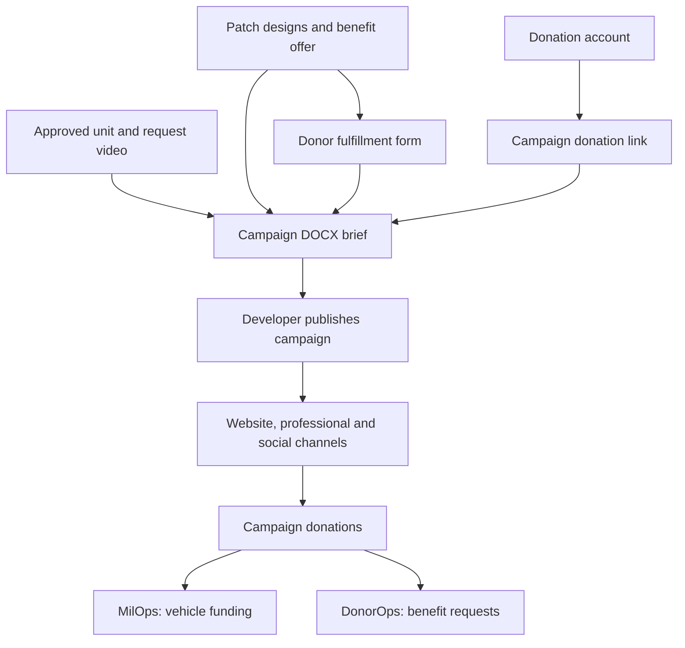
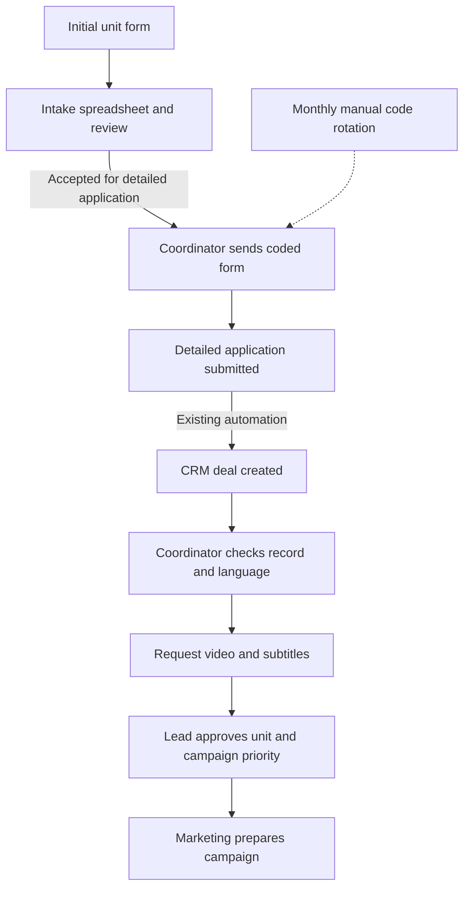
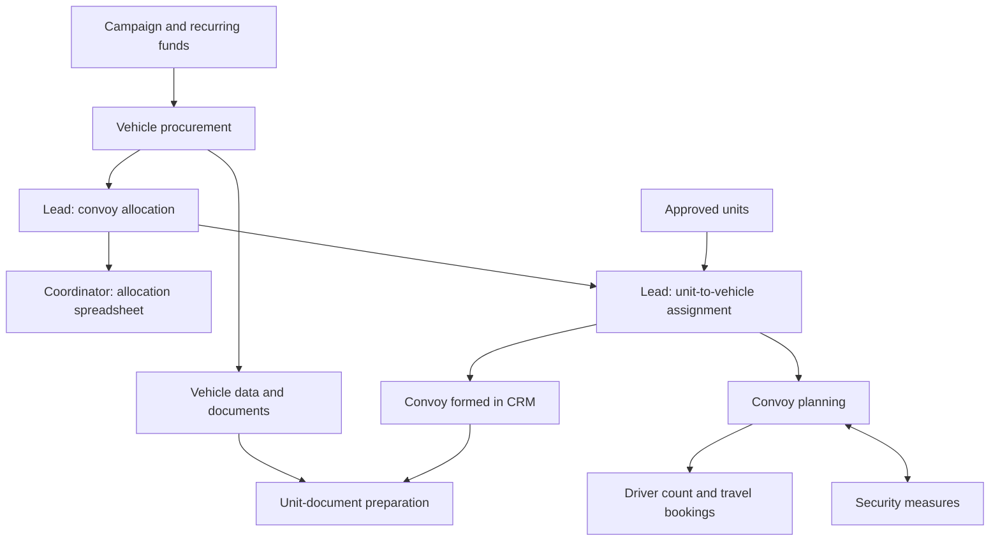
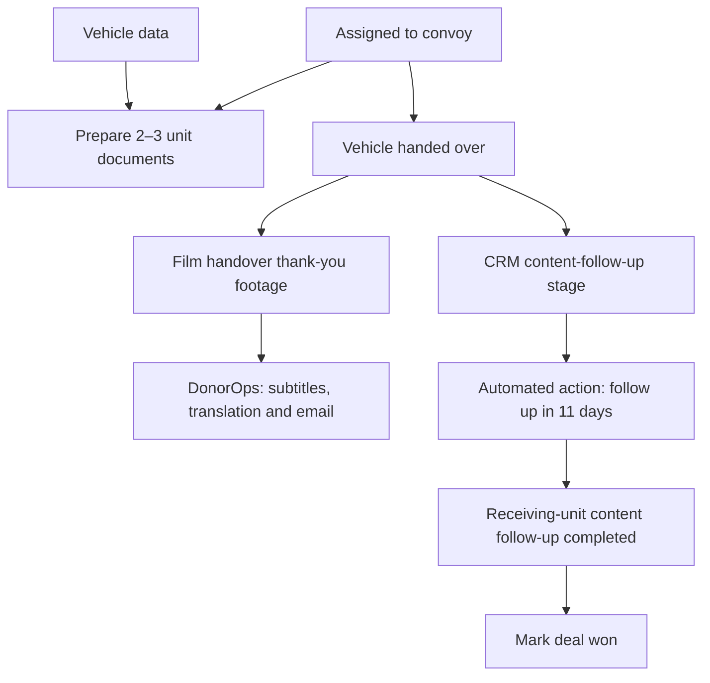
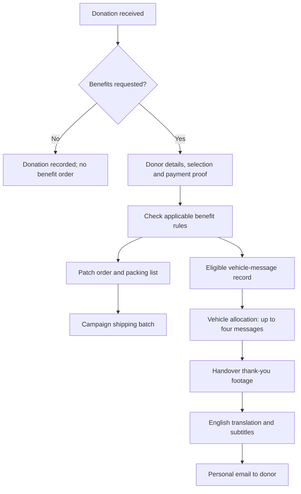
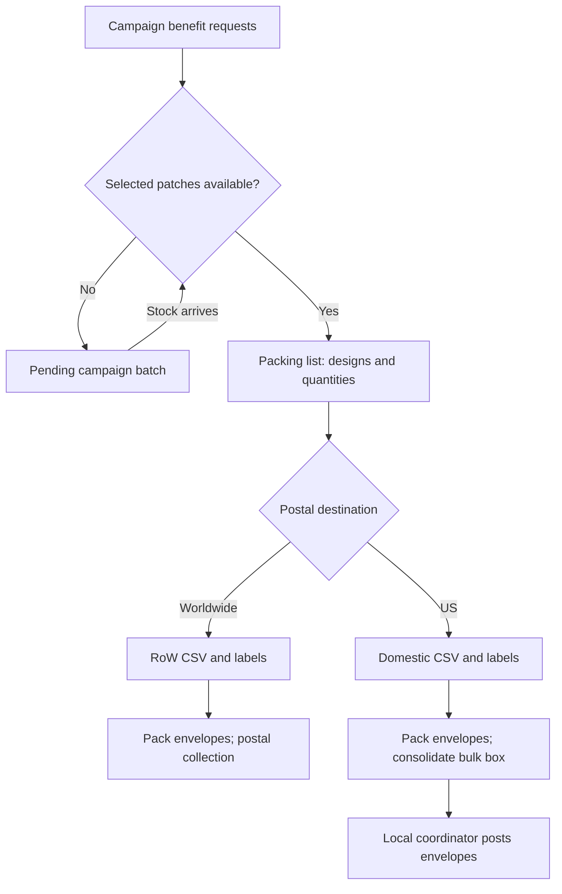
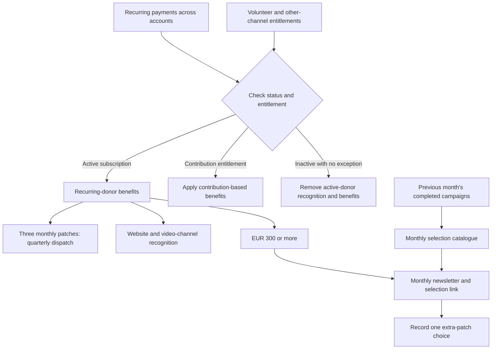
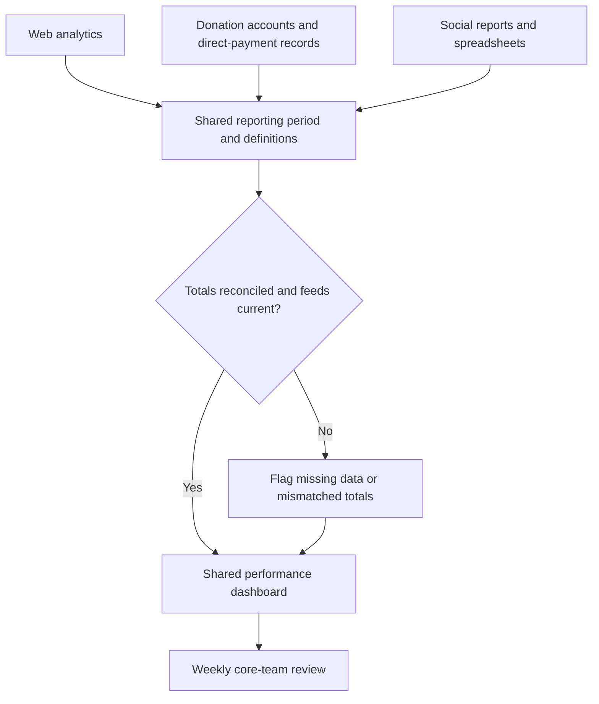

# OPS manUAl (v2–05.OCT.2026)

[Mission](#mission) · [Marketing](#marketing) · [MilOps](#milops) · [DonorOps](#donorops) · [OrgOps](#orgops) · [Handoffs](#handoffs) · [Development](#development)

## 1. MISSION & STRUCTURE

Deliver vehicles to approved receiving units. Generate funds, fulfill donor commitments, and complete post-delivery content follow-up.

**Three mission pillars. One shared support pillar.**

| Pillar | Responsibility | Operational output |
| --- | --- | --- |
| **Marketing & Fundraising** | Campaigns, public content, acquisition, recurring-donor conversion, performance reporting. | Funded campaigns and sustained donor support. |
| **MilOps** | Unit intake, approval, procurement, allocation, convoys, documents, delivery. | Vehicles delivered to approved units; CRM cycle completed. |
| **DonorOps** | Donation records, eligibility, patches, shipping, vehicle messages, personal thank-you videos. | Donor benefits and communications fulfilled. |
| **OrgOps** | People, access, systems, records, automation, coordination. | Reliable handoffs and shared operational information. |

**Operating conditions:** Forms, spreadsheets, payment accounts, and CRM carry different parts of the work. Most transfers require manual action. Existing automation creates CRM deals from unit applications and schedules post-delivery content follow-up.

**Improvement priorities:** Donor experience is the primary automation target. A shared marketing dashboard is the immediate reporting requirement. Tax-deductible fundraising is the strategic expansion programme.

## 2. MARKETING (+ FUNDRAISING)

### 2.1 Campaign preparation and publication

**Responsible functions:** Campaign lead, website developer, content contributors.

1. Receive the approved unit requirement and request video from MilOps.
2. Prepare the DOCX brief: title, campaign copy, header material, patch designs, donation link, and donor-form link. Reuse standard campaign content.
3. Configure the donation campaign and fulfillment form. Hand the brief to the website developer for publication through the existing site template.
4. Promote through the website, professional networks, and social channels.
5. Use handover and thank-you content for donor recognition and subsequent fundraising.

The campaign lead can edit routine website copy. The website developer handles campaign setup support and technical corrections to donation or form integrations.

### 2.2 Acquisition and retention

- Campaigns acquire one-time donors. Email follow-up invites them into recurring support.
- Request videos support campaign acquisition. Personal thank-you videos support recognition and retention.
- Website/professional-channel branding and social-channel branding represent the same operation. Consolidate their performance reporting.
- A campaign normally funds one vehicle; some fund several. Recurring revenue can fund additional vehicles outside individual campaigns.

### 2.3 Market development

| Market / activity | Position | Operating direction |
| --- | --- | --- |
| US tax-deductible channel | Established; up to **€100,000/month**. | Maintain the channel and use its performance to guide expansion. |
| UK and Germany | Next tax-deductible fundraising targets. | Establish the local operating arrangement and corresponding donation-account route. |
| German-language content | First localization priority; German-speaking markets represent approximately **15%** of the audience considered for expansion. | Cover Germany, Austria, and Switzerland through one language programme. |
| Japan | Exploratory; limited existing donor activity. | Secure an audience partner or on-camera advocate before committing to a dedicated campaign. |

Market entry depends on audience demand and a person able to run the local effort. Tax-deductible channel expansion and website translation are separate workstreams.

### 2.4 Performance reporting

Current inputs are web analytics, donation-account reports, and social-platform spreadsheets. Marketing defines the reporting needs; OrgOps builds and maintains the consolidated view. The dashboard requirements are in Section 7.1.

## 3. MilOps

### 3.1 Functions and authority

| Function | Responsibility |
| --- | --- |
| Approval and allocation lead | Approve units, set campaign priority, assign vehicles to units, allocate convoys. |
| Unit and records coordination | Review intake records, issue coded application invitations, complete CRM deals, maintain allocation data, prepare documents, follow up on content. |
| Procurement | Acquire vehicles and transfer their documentation and data into the allocation workflow. |
| Convoy coordination | Match drivers to vehicle count; arrange travel, accommodation, and convoy security measures. |
| Video production | Record handover thank-you footage and supply files for donor follow-up. |

### 3.2 Unit intake and approval

1. Collect the initial unit form into the intake spreadsheet.
2. Review the request. Send accepted applicants the coded detailed-application form manually.
3. Rotate the application code **monthly**, manually.
4. Transfer the completed application into CRM through the automation service. Use a **deal record** for the workflow.
5. Check and complete the generated record, including language cleanup. Arrange the request video and required subtitles.
6. Obtain the lead's unit approval and campaign prioritization. Pass the campaign material to Marketing.

### 3.3 Vehicles and convoy formation

Source vehicles across procurement markets. Transfer vehicle data and documents promptly to the allocation workflow. The lead records the unit-to-vehicle match in the allocation register; the coordinator maintains the associated spreadsheet.

Funding and available vehicles determine convoy capacity. Use **normally two drivers per vehicle** for planning. Arrange outward train travel, return flights, accommodation, and convoy security measures against the actual vehicle count.

### 3.4 Documents, delivery, and closure

- **Convoy assignment:** Prepare the **2–3 unit documents** using the vehicle data. Document preparation begins at assignment.
- **Handover:** Film the thank-you footage. Pass donor-specific material into the DonorOps workflow.
- **Post-delivery:** Move the CRM deal into content follow-up. Existing automation schedules a follow-up action **11 days after entering that stage**.
- **Follow-up:** Request receiving-unit photos or footage of the delivered vehicle. Complete the follow-up before marking the deal **won**.

**Keep the three content products distinct:** the request video supports fundraising; the handover video thanks the donor; later receiving-unit media completes operational content follow-up.

## 4. DonorOps

### 4.1 Donation accounts and payment routes

| Route | Function | Handling rule |
| --- | --- | --- |
| Main donation account | Current campaign collection and new donations. | Keep campaign and donor references attached to the payment. |
| Legacy donation account | Existing recurring subscriptions retained after the operating-entity change; approximately **700 donors / €70,000 per month**. | Preserve subscriptions. New acquisition is directed elsewhere; forced migration risks cancellations and failed renewals. |
| US donation account | Established tax-deductible fundraising channel. | Maintain its account identity in donation and reporting records. |
| Bank transfer | Separate direct-payment route. | Reconcile by payment reference. |
| Cryptocurrency | Separate payment route. | Include its records in reconciliation and reporting. |

Card, wallet, and other payment buttons can open the **same underlying donation account**. Preserve the donor's payment choices and count each payment once. The donation platform also provides campaign progress displays and payment credibility.

### 4.2 Benefit requests and eligibility

Benefits are optional. Some donors decline patches to reduce fulfillment costs, avoid sharing personal details, or avoid another form. A missing benefit form does not mean the donation failed.

**Fulfillment economics:** An illustrative €300 donation with three patches at approximately €2 each and €10 postage uses about **€16 before handling**. Workload and cost follow benefit requests, so keep donation counts and fulfillment counts separate.

The donor form collects the name, postal address, campaign/patch selection, applicable vehicle message, and a donation-proof screenshot. Collect a telephone number where the destination's postal service requires it.

| Condition | Fulfillment rule |
| --- | --- |
| Campaign donation **> €100** | Eligible for the campaign patch/form workflow. |
| Campaign patch shipment | **Maximum three patches per shipment.** |
| Donation **> €750** | Additional receiving-unit patch benefit. |
| Vehicle message **from €1,500** | Record the donor's message against its vehicle allocation. |
| Vehicle message capacity | **Maximum four messages per vehicle.** |
| Standard recurring support | **Three monthly patches shipped every three months.** |
| Recurring support **≥ €300** | Monthly extra-patch selection through the newsletter process. |
| Other recurring tiers | Apply the published tier's benefits, including additional patch or recognition entitlements. |
| Volunteer contribution | Preserve the associated benefit entitlement separately from payment status. |

**Packing exception:** Keep the unit-patch bonus visible alongside the three-patch limit. Automated packing must send overlapping bonus and quantity rules to the shipping function for review. Preserve the confirmed entitlement in the packing record.

### 4.3 Packing and postal dispatch

The fulfillment form feeds **three separate outputs**: postal data, the packing list, and vehicle-message records. A postal label supplies the destination; the packing list supplies the patch designs and quantities.

1. Assemble requests by campaign and patch availability.
2. Prepare the packing list and the destination-specific postal CSV.
3. Import the CSV into the appropriate postal system and generate labels.
4. Pack the selected designs, apply the labels, and dispatch through the relevant route.

| Route | Dispatch procedure | Constraint |
| --- | --- | --- |
| Worldwide | Generate worldwide-service labels; pack envelopes; hand the batch to the postal collector. | Use that carrier's CSV format. |
| US | Generate domestic labels using the local dispatch address; consolidate prepared envelopes into a bulk box; transfer it to the local coordinator for domestic posting. | Use a separate CSV format. Consolidation adds waiting time. |

The US batch route supports a donor market of roughly **30%** of the donor base. Indicative postage is approximately **$2 per item**, compared with approximately **$20** on the earlier individual route. Assess total batch cost separately. Batch collection is roughly **one–two weeks**, depending on the shipping queue; this is a planning interval.

**Inventory constraint:** Work by campaign. Patches can still be in production or unavailable. Limited storage makes partially packed envelopes waiting for designs from other campaigns impractical. A future donor basket must respect this constraint.

### 4.4 Vehicle messages and thank-you videos

| Step | Responsible function | Output / handoff |
| --- | --- | --- |
| Capture message | Donor coordination | Donor, campaign, and requested message in the message sheet. |
| Link message to vehicle | Donor coordination with MilOps | Vehicle assignment and message allocation within the four-message limit. |
| Film at handover | Video operator / production provider | Footage for the relevant vehicle and donor message. |
| Obtain files | Donor/content coordination | Production files passed to subtitle contributors. |
| Subtitle and translate | Subtitle contributors; outsourced support | English donor-ready video. |
| Deliver | Donor coordination | Personal email containing the correct video. |

File retrieval, contributor handoffs, and donor email delivery currently require coordination. The automation objective is to connect each uploaded video to its vehicle, message, and donor, then send it after subtitle work is complete.

### 4.5 Recurring support and exceptions

Maintain three distinct benefits: quarterly patch dispatch, public donor recognition, and the qualifying monthly extra-patch selection.

| Situation | Required treatment |
| --- | --- |
| Active recurring donor | Maintain the applicable patch and recognition benefits. |
| Payment missing from one account | Check the other accounts and payment routes before changing status. |
| Inactive donor with no other entitlement | Remove from the active-donor recognition list and stop active-donor benefits. |
| Volunteer receiving benefits | Retain the contribution-based entitlement independently of the subscription record. |
| New or upgraded qualifying subscription | Add to the extra-patch selection and newsletter lists. |

The **€300-or-more** process uses a monthly newsletter linking to the selection spreadsheet. Offer one patch from the previous month's completed campaigns. Record the donor's choice for fulfillment. Monthly selection and quarterly standard-patch shipping have different cadences.

## 5. OrgOps — SHARED SUPPORT

### 5.1 Coordination and access

The core team meets **weekly on Monday**. Day-to-day execution uses team messaging, shared files, and CRM. The reporting dashboard supports this core-team meeting; suppliers coordinate through the relevant operational function.

For systems onboarding: complete the contract, provision the work device and required access, introduce the website developer and functional counterparts, and walk through live processes with the people operating them.

### 5.2 System and record responsibilities

| System / record | Operational purpose | Responsible function |
| --- | --- | --- |
| Website CMS and campaign briefs | Campaign publication, donation/form links, public recognition. | Marketing; website developer. |
| Donation accounts and direct-payment records | Payments, campaign receipts, subscriptions, reconciliation. | DonorOps; Marketing for campaign setup/reporting. |
| Donor form and fulfillment sheets | Claims, postal details, patch choices, vehicle messages. | DonorOps. |
| Two postal systems | Carrier-specific imports and shipping labels. | Shipping function. |
| Initial and coded unit forms | Intake screening and detailed applications. | MilOps. |
| Intake spreadsheet and CRM deals | Application records, campaign progression, follow-up, closure. | MilOps. |
| Allocation register and vehicle spreadsheet | Unit-to-vehicle assignments, vehicle data, convoy formation. | Allocation lead; records coordinator. |
| Patch catalogue and selection sheet | Completed-campaign choices and donor selections. | DonorOps with Marketing. |
| Email and video platforms | Newsletters, personal follow-up, subtitles, translation. | Marketing; DonorOps; content contributors. |
| Analytics and social-platform sheets | Audience, channel, and campaign reporting. | Marketing. |
| Issue tracker, process map, and shared documentation | Automation work, dependencies, operating instructions. | OrgOps with functional owners. |

OrgOps supports integrations and access. The operational functions retain responsibility for their records and decisions.

### 5.3 Existing automation

| Trigger | Automated action | Human work retained |
| --- | --- | --- |
| Detailed unit application submitted | Transfer through the automation service; create CRM deal. | Check the record, arrange video, approve the unit. |
| Deal enters content-follow-up stage | Schedule the follow-up action for 11 days later. | Request content, complete follow-up, mark the deal won. |

### 5.4 Development constraints

- Preserve the legacy subscription channel and all existing payment routes.
- Keep unit-intake forms and donor-fulfillment forms distinct.
- Work with the website developer and donation-platform account manager on integrations; specialist platform support may need to be requested.
- Evaluate internal meeting-recording/transcription tooling against sensitive-data handling, implementation effort, and ongoing cost before committing to a build.

## 6. PILLAR HANDOFFS

| Trigger | From → to | Required handoff |
| --- | --- | --- |
| Unit approved for campaign | MilOps → Marketing | Unit requirement, checked CRM record, request video, campaign priority. |
| Campaign ready to publish | Marketing → website developer | DOCX brief, designs, donation link, donor-form link. |
| Benefit request received | DonorOps → shipping / MilOps | Packing and postal records / eligible vehicle message. |
| Vehicle allocated to convoy | Allocation lead → records / convoy coordination | Vehicle-unit match, vehicle data, document input, vehicle count. |
| Vehicle handed over | MilOps / production → DonorOps | Donor-linked thank-you footage. |
| Subtitles and translation complete | Content contributors → DonorOps | Donor-ready file for personal email. |
| Campaign completed | Marketing → DonorOps | Eligible patch design for the monthly selection catalogue. |
| Recurring status changes | DonorOps → recognition / fulfillment | Reconciled eligibility and any contribution-based exception. |
| Weekly reporting cycle | Marketing + OrgOps → core team | Consolidated performance view and data exceptions. |

## 7. DEVELOPMENT PROGRAMME

### 7.1 Immediate deliverable: shared reporting dashboard

**Business lead:** Marketing & Fundraising. **Systems support:** OrgOps.

| Feed | Required reporting view |
| --- | --- |
| Web analytics | Traffic, acquisition sources, geography, campaign-page performance. |
| All donation accounts | Campaign receipts, account totals, one-time and recurring income. |
| Separate bank / cryptocurrency records | Receipts outside the hosted donation accounts. |
| Social-platform reports and spreadsheets | Channel activity, reach, engagement, campaign performance. |

**Build requirements:** One reporting period; explicit currency treatment; separate payment-account and payment-method fields; transaction reconciliation; visible refresh times; flagged missing feeds. Retain each platform's metric definition when presenting comparisons.

**Completion test:** The core team can use one view for the weekly meeting, trace totals to the underlying reports, and identify stale or missing data without assembling several spreadsheets manually.

### 7.2 Primary automation: donor fulfillment

**Business lead:** DonorOps. **Systems support:** OrgOps and the website developer. **Content dependency:** MilOps and production contributors.

| Trigger | Required automated outcome | Exception handling |
| --- | --- | --- |
| Donation received | Match the payment, account, campaign, and donor. Offer the appropriate optional benefits. | Retain manual handling for unmatched payments and separate payment routes. |
| Benefit request submitted | Reuse saved details where available; capture current selections; generate the fulfillment record. | Preserve opt-out and destination-specific phone requirements. |
| Campaign stock ready | Prepare the packing list and correct postal export. | Hold unavailable stock; preserve campaign batches; review bonus/quantity overlaps. |
| Handover video uploaded | Link the file to vehicle, message, and donor; route to subtitle contributors. | Hold unlinked files for coordination. |
| Subtitle work completed | Send the correct donor email and record delivery. | Prevent duplicate sends and retain a retry path. |
| Subscription starts or upgrades | Reconcile status; update eligible recognition, selection, and email lists. | Preserve other-channel payments and volunteer entitlements. |
| Campaign completes | Add the applicable design to the selection catalogue. | Apply the monthly offer rules and stock constraints. |

**Donor profile:** Enable reusable, editable shipping details as a development option. Replace proof screenshots when a payment can be matched reliably. A multi-campaign basket depends on stock visibility and a workable packing/storage process.

**Completion test:** A benefit request reaches the correct shipping queue, and a completed video reaches the correct donor, with each exception visible and no forced migration of recurring subscriptions.

### 7.3 Follow-on work

| Workstream | Intended result | Dependency |
| --- | --- | --- |
| Vehicle-document extraction | Read VIN, production year, make, and model from document images into the vehicle record. | Coordinator validation and consistent vehicle references. |
| Unit-document generation | Populate the 2–3 document templates from the vehicle and unit records at convoy assignment. | Reliable allocation data and document templates. |
| Request-video intake | Upload footage directly into the relevant CRM workflow. | File-to-deal association and contributor access. |
| Localization and new donation channels | Deliver the UK/Germany and German-language priorities in Section 2.3. | Local operating counterpart, website work, campaign reporting. |
| Internal recording / transcription | Assess a controlled alternative for sensitive meetings. | Cost, maintenance capacity, and data-handling requirements. |

**Diagram notation:** solid arrows show workflow and record dependencies; dashed arrows mark maintenance. Section 7 describes development targets.

